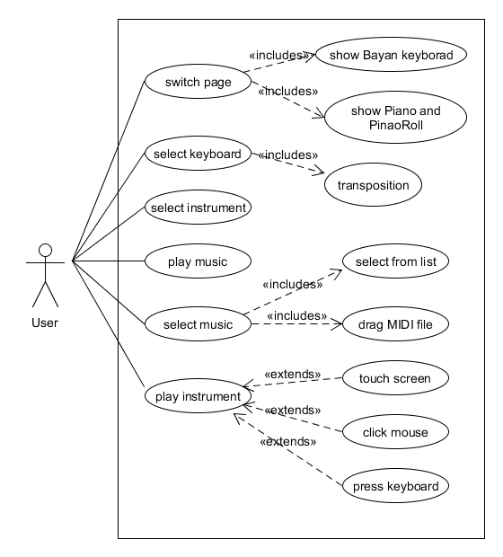

# 软件设计文档

>小组成员：方铭、徐佳豪、卢卓君、杜泽炜、梁智辉

Color Bayan 是一款使用QWERTY键盘演奏钢琴曲的模拟钢琴软件，
我们参考了巴扬手风琴右手的键盘布局，将QWERTY键盘和钢琴键盘对应，
设计了一套在PC上也能够灵活演奏较复杂乐曲演奏键盘。Color Bayan 支持播放MIDI音乐文件，读取伴奏MIDI文件同时进行演奏，以及显示卷帘动画等功能。
具体功能详见用户手册。

本项目交互性很强，音乐演奏和播放对实时性的要求很高，因此很适合采用web技术，以避免底层的多线程开发。考虑到本项目成立之初就是为了让音乐在社会中流行起来，产品的基因很适合在互联网中传播和发展，因此我们决定采用web技术来实现本项目。

项目以前端为主，后端配合管理音色库文件和音乐文件来响应前端的数据请求，从而控制了前端的规模大小，对用户的即时访问更加友好。


我们主要采用敏捷开发（Scrum开发）作为我们的开发方法，迭代周期为1周。我们先重点实现了前端部分，快速构建了产品模型，再以个人为单位分配工作任务创建分支，以最先最好实现功能的分支为准，并入主分支进行迭代开发。
项目初期的backlog如下：

| 名称   | 对象  | 重要性  | 具体内容 | 备注 |
|-----   | ----- | ------ | ------ | ----- | 
| 切换界面 | 用户 | S | 点击乐器对应的按钮，即可切换 | 界面简洁，重点突出 | 
| 音色库 | 用户 | S | 使用每种乐器对应的音色库 | 模仿效果逼真 | 
| 鼠标键盘 | 用户 | S | 用鼠标和键盘模拟琴键进行演奏 | 反应迅速 | 
| 改变颜色 | 用户 | S | 巴扬界面根据声调的不同显示不同的颜色 | 颜色种类丰富 |
| 卷帘动画 | 用户 | S | 钢琴页面根据按下的琴键，生成动画效果 | 华丽酷炫 | 
| 切换布局 | 用户 | S | 拓展用键盘模拟的琴键个数，便于演奏 | 自由切换，相应迅速 | 
| 转调 | 用户 | S | 使用特定的按键来升高或降低音调 | 更宽的音域选择 | 
| 解析本地文件 | 用户 | S | 将本地文件拖到浏览器，即可进行解析并可以自动播放；显示按键过程，方便学习 | 支持所有midi文件 |
| 自适应音域 | 用户 | S | 根据提供的文件，自动调整到合适的音域进行模拟演奏 | 文件还原度较高 |


接下来详细介绍前端项目技术选型、架构设计以及模块划分。

## 1、技术选型以及理由

采用Typescript+jQuery作为我们的程序设计语言，采用HTML和CSS技术，配合Material UI 这个CSS框架来绘制界面。乐曲格式采用MIDI技术，音色库采用别人实现已经渲染好的结果文件 。

TypeScript是一种由微软开发的自由和开源的编程语言。它是JavaScript的一个超集，而且本质上向这个语言添加了可选的静态类型和基于类的面向对象编程。TypeScript扩展了JavaScript的语法，所以任何现有的JavaScript程序可以不加改变的在TypeScript下工作。TypeScript是为大型应用之开发而设计，而编译时它产生 JavaScript 以确保兼容性。TypeScript 支持为已存在的 JavaScript 库添加类型信息的头文件，扩展了它对于流行的库如 jQuery，MongoDB，Node.js 和 D3.js 的好处。TypeScript的语法和c++比较接近，开发和调试都比原始的JavaScript简单一点。

jQuery是一个快速、简洁的JavaScript框架，是继Prototype之后又一个优秀的JavaScript代码库（或JavaScript框架）。jQuery设计的宗旨是“write Less,Do More”，即倡导写更少的代码，做更多的事情。它封装JavaScript常用的功能代码，提供一种简便的JavaScript设计模式，优化HTML文档操作、事件处理、动画设计和Ajax交互。
jQuery的核心特性可以总结为：具有独特的链式语法和短小清晰的多功能接口；具有高效灵活的css选择器，并且可对CSS选择器进行扩展；拥有便捷的插件扩展机制和丰富的插件。jQuery兼容各种主流浏览器，如IE 6.0+、FF 1.5+、Safari 2.0+、Opera 9.0+等。

Material UI 是一款功能非常强大，界面却十分清新简洁的CSS框架，Material UI利用了Google的Material Design 全新设计语言，并且让每一个UI组件都变得非常独立，因此开发者使用Material UI也会比较简单。和Bootstrap类似，Material UI提供了很多常用的UI组件，除了最基本的菜单、按钮、滑动杆、进度条、单选框/复选框外，它还提供了一个非常有趣的日历组件，另外还提供了一些很有趣的图标。

支持的音乐文件格式为MIDI。
MIDI(Musical Instrument Digital Interface)乐器数字接口，是20 世纪 80 年代初为解决电声乐器之间的通信问题而提出的。MIDI是编曲界最广泛的音乐标准格式，可称为“计算机能理解的乐谱”。它用音符的数字控制信号来记录音乐。一首完整的MIDI音乐只有几十KB大，而能包含数十条音乐轨道。几乎所有的现代音乐都是用MIDI加上音色库来制作合成的。MIDI 传输的不是声音信号，而是音符、控制参数等指令, 它指示MIDI 设备要做什么，怎么做， 如演奏哪个音符、多大音量等。它们被统一表示成 MIDI 消息(MIDI Message) 。传输时采用异步串行通信, 标准通信波特率为31.25×( 1±0.01) KBaud。

音色库采用 [MIDI Soundfonts] (https://github.com/gleitz/midi-js-soundfonts),
详情介绍见链接。

## 2、架构设计

首先将所有的代码统一放在了src文件夹里，然后根据具体的用途和语言类型分为以下4个目录。

前端：
* *css*：层叠样式表目录，用于定义界面需要用到的各种样式
* *ts*：项目的Typescript源代码，前端都在这个文件夹里进行开发
* index.html:网页的搭建和索引

后端：
* *assets*：资源目录，包含两个子目录。
instrument 用于存放不同乐器的音色库，音乐格式为mp3文件。
music 用于存放乐曲文件，格式为midi文件。
* *server*：项目使用node.js搭建后端的代码


Typescript 需要先编译成js才可以真正执行；我们选择使用gulp来进行热编译和链接各个文件生成前端页面同时运行后端。编译后，会生成一个dist目录。打开使用chrome内核的浏览器，在地址栏输入：localhost:8081，即可运行。

设计思想：
* 音域：
统一所有乐器的音域，使用标准钢琴键盘上的全音域，即A0-C8，编号为0-87，共88个不同的音高。切换乐器仅仅只是改变音色。
* 钢琴键盘：
在钢琴界面上绘制了一个标准钢琴键盘，共88键（其中白建52个，黑键36个），琴键音高固定，点击可以发声变色，部分琴键可通过QWERTY键盘的映射来实现键盘控制演奏。
* 巴扬键盘：
巴扬键盘使用QWERTY键盘的主键盘区，排布采用巴扬手风琴右手[B系统键钮](http://thecipher.com/c_and_b_system_cba_spelling.html)，一个八度的十二个音分布在3排，4列。QWERTY键盘第四排是第一排的周期性延拓，一共有35个不同的键位，几乎能跨三个八度。如果把一个八度的十二个音分布在4排那么只需要3列就可以排好一个八度，差不多能跨四个八度，但是这样会增加弹奏难度。
* MIDI文件：MIDI文件有不同的音轨，每个音轨有不同的乐器，节奏。本项目忽略打击乐器，同步合并所有音轨为单一音轨，忽略原MIDI文件制定的乐器，使用音色库选定的乐器音色进行播放MIDI文件。


[](http://thecipher.com/cba_b_system_spelling.html)
[](http://thecipher.com/cba_b_system_basics.html)

## 3、领域模型


## 4、模块划分
* 自动播放：分为时间控制，解析文件，传送相关音色库的编码
* 发声模块：根据相应的键盘按钮映射到琴键，然后获取相应的音色库中的文件并发声。根据建立好的颜色映射关系，改变琴键的颜色。
* 乐器界面：软件主要分为基于巴扬和钢琴的2个界面。根据不同乐器的琴键排布特点来设计硬盘的映射关系。

```txt
├─css: 存放页面所用到的样式
│   ├─index.css：初始页面的样式
│   └─piano.css：钢琴页面时的样式
├─lib: 存放后端处理用到的文件
│   ├─instrument：音色库文件
│   └─music： MIDI 音乐文件
├─sever：存放服务器代码
│   └─server.js：后端处理代码
├─src：前端的Typescript代码
│   ├─Bayan.ts：巴扬的整体设计
│   ├─BayanKey.ts：巴扬乐器每个琴键的设计
│   ├─ColorMap.ts: 建立音调和颜色的对应关系库  
│   ├─dropEvent.ts: 解析拖动到页面中的mid文件
│   ├─init.ts：页面的初始化和启动
│   ├─keybdEvent.ts：定义键盘事件
│   ├─mainController.ts：控制自动播放
│   ├─midiFileProsess.ts：处理mid文件
│   ├─MIDIParser.ts：解析mid文件
│   ├─Piano.ts：创建钢琴的页面并进行相关设置
│   ├─PianoRoll.ts：在钢琴下方加上卷帘的动画效果
│   ├─request.ts：获取页面的各种请求
│   ├─soundEvent.ts：将琴键的发声组合成一个事件
│   ├─SoundFont.ts：单个琴键的发生
│   └─TimeController.ts：时间定时控制器
└─index.html
```
## 5、主要用例图



## 6、设计模式
* 单例模式：应用中将数据从视图层抽离，放到一个应用全局的位置进行管理，所有页面使用的都是同一份数据。当数据更新的时候所有引用到数据的界面也会同步更新。代码复杂度降低，内存使用情况也得到了优化。该模式基本覆盖到了所有类的调用和声明。
* 面向对象编程：应用中使用了面向对象编程的封装思想，按照实现的功能对各个模块进行了封装。特别是将巴扬和钢琴两种不同的乐器独立出来，单独实现了Bayan.ts和Piano.ts这两个不同的类。这两种乐器差别很大，面向对象的设计，对于琴键的布局以及切换，还有发声的选择和调整，都有很大的帮助。
